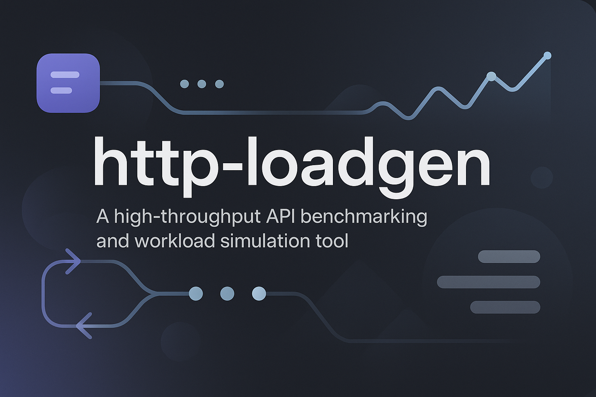

# http-loadgen




---

`http-loadgen` is a high-throughput, configurable **HTTP benchmarking and workload simulation tool**.  
Use it to load test any read/write API — including permission systems like [Ory Keto](https://www.ory.sh/docs/keto).

---

## 🚀 Quick Start

```bash
./scripts/run.sh
````

This runs the default benchmark defined in `config/config.yaml`.

---

## 📊 Benchmark Matrix

To run multiple configurations and generate a report:

```bash
./scripts/run.sh --benchmark
```

Results are written to:

```
benchmark_results.csv
```

---

## 🧪 Example: Test Ory Keto

Use this config:

```yaml
# api/keto.yaml
api:
  write_api: http://localhost:4467
  read_api: http://localhost:4466

requests:
  write:
    method: PUT
    url: "{{ .WriteAPI }}/admin/relation-tuples"
    headers:
      Content-Type: application/json
    body: |
      {
        "namespace": "documents",
        "object": "{{ .object }}",
        "relation": "viewer",
        "subject_id": "user:{{ .subject }}"
      }

  read:
    method: POST
    url: "{{ .ReadAPI }}/relation-tuples/check"
    headers:
      Content-Type: application/json
    body: |
      {
        "namespace": "documents",
        "object": "{{ .object }}",
        "relation": "viewer",
        "subject_id": "user:{{ .subject }}"
      }
```

And run:

```bash
./http-loadgen --workload-config=./config/config.yaml --log-file=run.log
```

---

## 📁 Folder Layout

```
api/              # API-specific configurations (e.g., Keto)
config/           # Loadgen settings: concurrency, retries, durations
scripts/          # run.sh and benchmark automation
internal/         # Core logic: request engine, metrics, generator
cmd/              # CLI entrypoint (main.go)
```

---

## 🔧 CLI Flags

| Flag                  | Description                              |
|-----------------------|------------------------------------------|
| `--duration-sec`      | Duration to run the test                 |
| `--concurrency`       | Number of concurrent workers             |
| `--checks-per-second` | Max read requests per second             |
| `--read-ratio`        | Read to write ratio (e.g., 100 = 100:1)  |
| `--workload-config`   | Path to YAML config file                 |
| `--log-file`          | Where to write logs                      |
| `--verbose`           | Enable detailed logging                  |
| `--max-retries`       | Retry attempts per request               |
| `--retry-delay`       | Delay between retries (ms)               |
| `--request-timeout`   | Timeout per HTTP request (sec)           |
| `--max-open-conns`    | Max HTTP connections                     |
| `--max-idle-conns`    | Max idle connections                     |
| `--serve-metrics`     | Keep Prometheus metrics server alive     |
| `--dry-run`           | Run logic without making real HTTP calls |

---

## 📦 Build

```bash
make build
```

Or build via Docker:

```bash
docker build -t http-loadgen:latest .
```

---

## 📈 Live Metrics

Run with:

```bash
--serve-metrics
```

Then scrape:

```
http://localhost:2112/metrics
```

Prometheus-compatible metrics include:

* `retry_attempts_total`
* `retry_success_total`
* `permission_check_total`
* `retry_duration_seconds`

---

## 💡 Why Benchmark APIs Instead of the DB?

This tool mimics real-world client behavior — it:

* Hits live HTTP endpoints
* Tests retry logic, latency, and concurrency
* Measures API performance under real query pressure

Not just the raw DB underneath.

---

## 📖 References

* [Ory Keto](https://www.ory.sh/docs/keto)
* [CockroachDB](https://www.cockroachlabs.com/docs/)
* [Prometheus](https://prometheus.io/)
